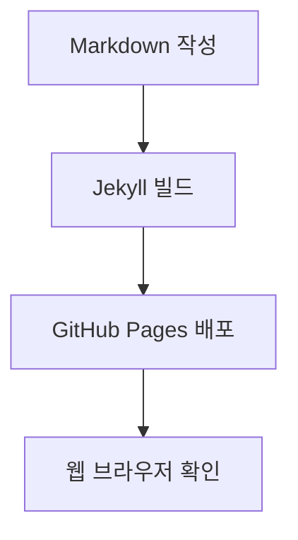

마크다운(Markdown)은 텍스트 기반의 가벼운 마크업 언어로, 개발 문서 작성·블로그 포스팅·GitHub README 등에서 널리 쓰입니다.

이 포스트 하나로 **기본 문법부터 확장 문법(GFM, 수식, 콜아웃, 다이어그램 등)**까지 모든 내용을 확인하고 바로 복사해 활용할 수 있도록 총정리했습니다.

---

## 목차
1. [제목 (Heading)](#1-제목-heading)
2. [텍스트 서식 (Text Formatting)](#2-텍스트-서식-text-formatting)
3. [목록 (List) & 할 일 목록 (Task List)](#3-목록-list--할-일-목록-task-list)
4. [링크 (Link) & 이미지 (Image)](#4-링크-link--이미지-image)
5. [인용구 (Blockquote) & 콜아웃 (Callout / Alert)](#5-인용구-blockquote--콜아웃-callout--alert)
6. [코드 블록 (Code Block) & 문법 강조](#6-코드-블록-code-block--문법-강조)
7. [표 (Table)](#7-표-table)
8. [구분선 & 줄바꿈](#8-구분선--줄바꿈)
9. [접기/펼치기 (Details)](#9-접기펼치기-details)
10. [각주 (Footnote) & 이스케이프 문자](#10-각주-footnote--이스케이프-문자)
11. [수식 (LaTeX) & 다이어그램 (Mermaid)](#11-수식-latex--다이어그램-mermaid)

---

## 1. 제목 (Heading)

`#` 기호의 개수로 `<h1>`부터 `<h6>`까지의 제목 레벨을 표현합니다.

### 📝 작성 문법
```markdown
# H1 - 대제목 (주로 글 제목으로 사용)
## H2 - 중제목 (주요 섹션)
### H3 - 소제목 (소단락)
#### H4 - 소소제목
##### H5 - 세부 제목
###### H6 - 최소 단위 제목
```

> 💡 **Tip:** H1은 포스트 제목으로 이미 사용되므로, 본문 소제목은 보통 `## (H2)`나 `### (H3)`부터 시작하는 것이 SEO와 가독성에 좋습니다.

---

## 2. 텍스트 서식 (Text Formatting)

글자 강조, 기울임, 취소선, 밑줄, 인라인 코드 등을 표현합니다.

### 📝 작성 문법
```markdown
*기울임(Italic)* 또는 _기울임_
**굵게(Bold)** 또는 __굵게__
***굵은 기울임(Bold Italic)***
~~취소선(Strikethrough)~~
<u>밑줄(Underline - HTML 태그)</u>
`인라인 코드(Inline Code)`
```

### 렌더링 결과
- *기울임(Italic)* 또는 _기울임_
- **굵게(Bold)** 또는 __굵게__
- ***굵은 기울임(Bold Italic)***
- ~~취소선(Strikethrough)~~
- <u>밑줄(Underline)</u>
- `인라인 코드(Inline Code)`

---

## 3. 목록 (List) & 할 일 목록 (Task List)

### 3.1 순서 없는 목록 (Unordered List)
`-`, `*`, `+` 기호를 사용하며, 탭(Tab) 또는 공백 2~4칸으로 들여써 하위 목록을 만듭니다.

```markdown
- 첫 번째 항목
  - 서브 항목 A
  - 서브 항목 B
    - 하위 세부 항목
- 두 번째 항목
- 세 번째 항목
```

### 3.2 순서 있는 목록 (Ordered List)
숫자와 마침표(`.`)를 사용합니다. 번호는 자동으로 매겨지므로 번호를 임의로 적어도 순서대로 렌더링됩니다.

```markdown
1. 첫 번째 단계
2. 두 번째 단계
   1. 세부 단계 2-1
   2. 세부 단계 2-2
3. 세 번째 단계
```

### 3.3 할 일 목록 / 체크리스트 (Task List)
`- [ ]`와 `- [x]`를 사용해 체크박스를 만듭니다.

```markdown
- [x] 블로그 개설 완료
- [x] Chirpy 테마 설정
- [ ] 첫 포스트 배포하기
- [ ] 구글 서치콘솔 등록
```

---

## 4. 링크 (Link) & 이미지 (Image)

### 4.1 링크
```markdown
<!-- 인라인 링크 -->
[Google 바로가기](https://www.google.com)

<!-- 툴팁(Title)이 있는 링크 -->
[GitHub 바로가기](https://github.com "깃허브로 이동")

<!-- 자동 링크 -->
<https://github.com>
```

### 4.2 이미지 삽입
느낌표(`!`)를 앞에 붙이면 이미지를 삽입할 수 있습니다. 대체 텍스트(Alt text)는 이미지 로드 실패 시 노출됩니다.

```markdown


```

### 4.3 링크가 걸린 이미지
이미지 문법을 링크 텍스트 자리에 감쌉니다.

```markdown
[](이동할_링크URL)
```

---

## 5. 인용구 (Blockquote) & 콜아웃 (Callout / Alert)

### 5.1 기본 인용구
`>` 기호를 사용하여 작성하며, 중첩도 가능합니다.

```markdown
> 이것은 인용구입니다.
>> 중첩된 인용구도 표현할 수 있습니다.
```

### 5.2 GitHub / Chirpy 스타일 콜아웃 (Alerts)
중요도별로 알림 상자를 예쁘게 표시할 수 있습니다.

```markdown
> [!NOTE]
> 유용한 배경 지식이나 일반적인 참고 사항을 전달할 때 사용합니다.

> [!TIP]
> 더 나은 팁이나 성능 최적화, 꿀팁을 안내할 때 유용합니다.

> [!IMPORTANT]
> 사용자가 반드시 알아야 하는 핵심 내용을 강조합니다.

> [!WARNING]
> 주의해야 할 점이나 잠재적인 문제를 경고합니다.

> [!CAUTION]
> 데이터 손실이나 위험한 작업에 대해 주의를 환기합니다.
```

---

## 6. 코드 블록 (Code Block) & 문법 강조

백틱(`` ` ``) 3개를 감싸고 프로그래밍 언어명을 지정하면 구문 강조(Syntax Highlighting)가 적용됩니다.

### 📝 작성 문법

````markdown
```python
def greet(name: str) -> str:
    # 인사말을 출력하는 함수
    return f"안녕하세요, {name}님!"

print(greet("Jekyll"))
```
````

````markdown
```javascript
const user = { name: "Developer", role: "Admin" };
console.log(`Hello, ${user.name}`);
```
````

````markdown
```bash
# 패키지 설치
bundle install
bundle exec jekyll serve
```
````

---

## 7. 표 (Table)

파이프(`|`)와 하이픈(`-`)을 사용하여 표를 작성합니다. 콜론(`:`) 위치로 텍스트 정렬을 지정할 수 있습니다.

### 📝 작성 문법
```markdown
| 기능 | 구문 | 기본 정렬(좌) | 중앙 정렬 | 우측 정렬 |
| :--- | :--- | :--- | :---: | ---: |
| 굵게 | `**텍스트**` | 내용 1 | 중앙 1 | 1,000원 |
| 기울임 | `*텍스트*` | 내용 2 | 중앙 2 | 25,000원 |
| 취소선 | `~~텍스트~~` | 내용 3 | 중앙 3 | 350,000원 |
```

### 렌더링 결과

| 기능 | 구문 | 기본 정렬(좌) | 중앙 정렬 | 우측 정렬 |
| :--- | :--- | :--- | :---: | ---: |
| 굵게 | `**텍스트**` | 내용 1 | 중앙 1 | 1,000원 |
| 기울임 | `*텍스트*` | 내용 2 | 중앙 2 | 25,000원 |
| 취소선 | `~~텍스트~~` | 내용 3 | 중앙 3 | 350,000원 |

---

## 8. 구분선 & 줄바꿈

### 8.1 가로 구분선 (Horizontal Rule)
하이픈(`---`), 별표(`***`), 밑줄(`___`)을 3개 이상 연속으로 작성합니다.

```markdown
---
```

### 8.2 줄바꿈 (Line Break)
- 마크다운 기본 문법: 문장 끝에 **공백 2칸(Space 2번)**을 넣고 줄을 바꿉니다.
- 단락 구분: 엔터키(Enter)를 2번 눌러 빈 줄을 하나 만듭니다.
- HTML 태그: `<br>` 태그를 사용해도 강제 줄바꿈이 됩니다.

---

## 9. 접기/펼치기 (Details)

긴 코드나 부가 설명을 깔끔하게 접어둘 때 HTML `<details>` 태그를 활용합니다.

### 📝 작성 문법
```html
<details>
<summary>👉 상세 내용 펼쳐보기 (클릭)</summary>

여기에 숨겨둘 내용을 작성합니다.
마크다운 문법도 자유롭게 넣을 수 있습니다.
- 항목 1
- 항목 2

</details>
```

<details>
<summary>👉 상세 내용 펼쳐보기 (클릭)</summary>

여기에 숨겨둘 내용을 작성합니다.
- 항목 1
- 항목 2

</details>

---

## 10. 각주 (Footnote) & 이스케이프 문자

### 10.1 각주 (Footnote)
문장 뒤에 `[^1]`을 붙이고, 본문 하단에 주석 내용을 정의합니다.

```markdown
마크다운은 존 그루버(John Gruber)에 의해 2004년에 만들어졌습니다.[^1]

[^1]: 존 그루버의 공식 Daring Fireball 웹사이트 참조.
```

### 10.2 이스케이프 (Escape) 문자
마크다운 문법 기호를 기호 그대로 화면에 표시하고 싶을 땐 역슬래시(`\`)를 앞에 붙입니다.

```markdown
\*이 텍스트는 기울임 처리되지 않고 별표가 그대로 나옵니다\*
\# 이것은 제목이 아닙니다.
\[링크 형태 유지\]
```

---

## 11. 수식 (LaTeX) & 다이어그램 (Mermaid)

### 11.1 수식 표현 (LaTeX Math)
수식 앞뒤에 `$`(인라인) 또는 `$$`(블록)를 사용합니다.

```markdown
인라인 수식: $E = mc^2$

블록 수식:
$$
\int_{a}^{b} f(x)\,dx = F(b) - F(a)
$$
```

### 11.2 다이어그램 (Mermaid)
흐름도, 시퀀스 다이어그램 등을 코드로 그릴 수 있습니다.

````markdown

````


---

## 💡 한눈에 보는 마크다운 치트시트 요약

| 요소 | 마크다운 문법 | 비고 |
| :--- | :--- | :--- |
| **제목** | `# H1`, `## H2`, `### H3` | `#` 개수로 조절 |
| **강조** | `**굵게**`, `*기울임*`, `~~취소~~` | 기본 스타일 |
| **목록** | `- 항목`, `1. 항목`, `- [x] 할일` | 들여쓰기로 중첩 |
| **링크/이미지** | `[텍스트](URL)`, `` | `!` 유무 차이 |
| **인용/알림** | `> 인용`, `> [!NOTE]` | 콜아웃 지원 |
| **코드** | ` `인라인` `, ` ```언어 ` | 문법 하이라이팅 |
| **표** | `| 열1 | 열2 |` | `:` 위치로 정렬 |
| **수식/다이어그램** | `$$ 수식 $$`, ` ```mermaid ` | LaTeX / Mermaid |

---

## 마무리

마크다운은 단순하면서도 표현력이 뛰어나 블로그 포스팅과 기술 문서 작성의 생산성을 크게 높여줍니다.
자주 사용하는 문법 위주로 사용해 보시면서 필요할 때마다 이 가이드를 치트시트로 활용해 보세요!
