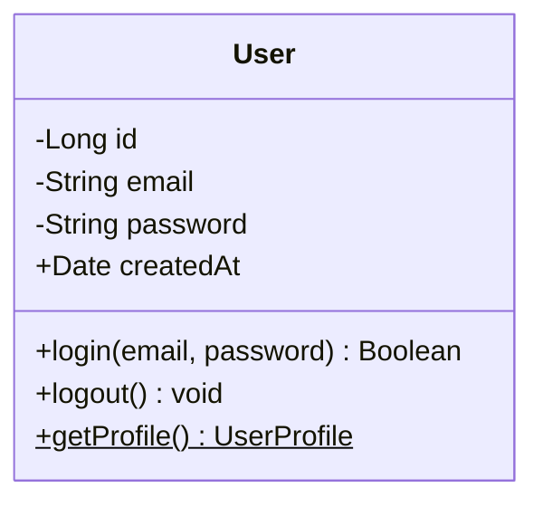
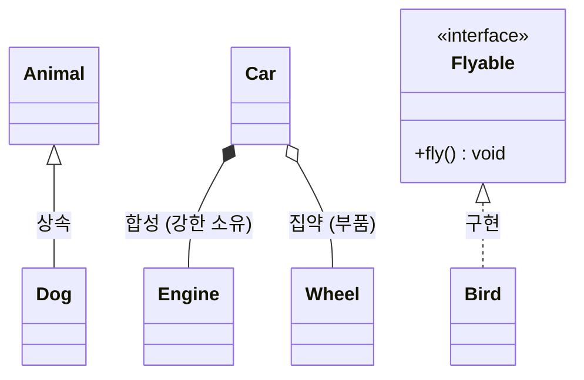
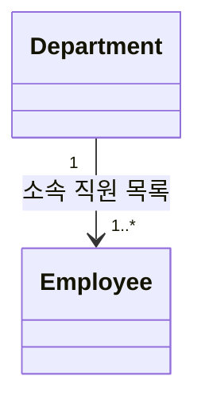
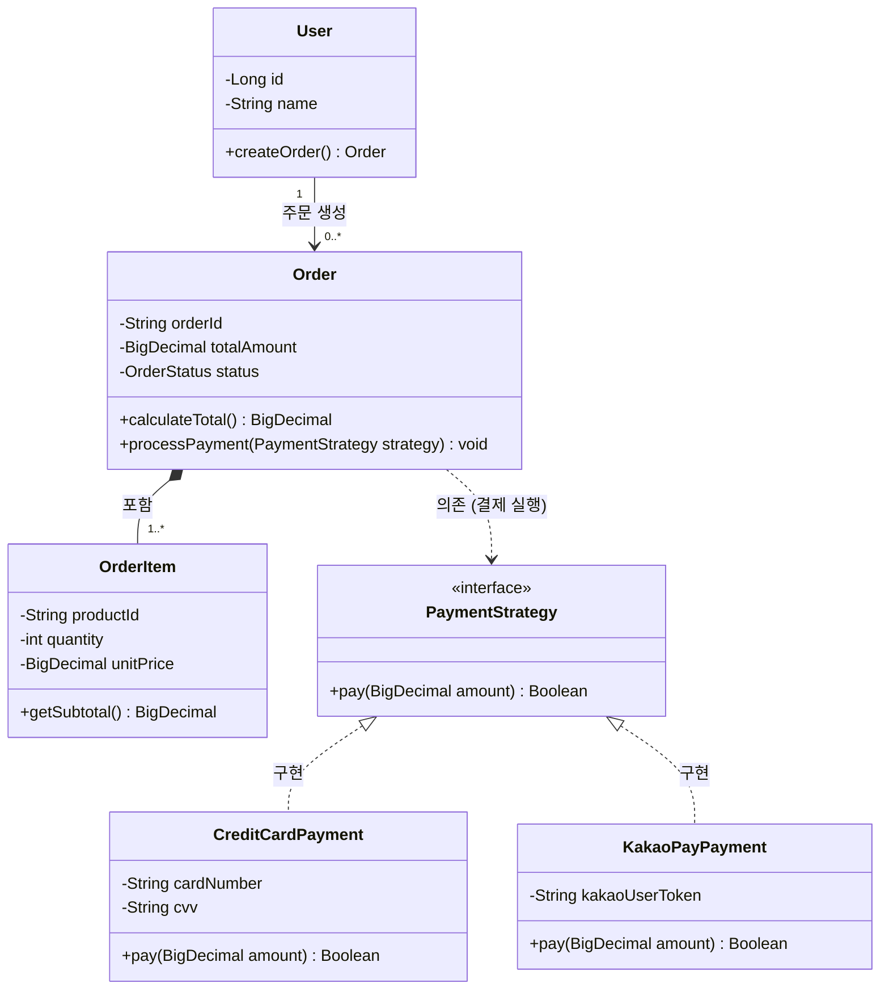


클래스 다이어그램(Class Diagram)은 객체지향 프로그래밍(OOP)에서 **시스템의 정적 구조, 클래스의 속성 및 메서드, 그리고 클래스 간의 관계**를 모델링할 때 표준으로 사용되는 다이어그램입니다.

---

## 1. 클래스 정의 및 필드/메서드 선언

`classDiagram` 키워드로 선언하며, 클래스 내부에 타입과 필드명, 메서드를 정의합니다.

### 1.1 접근 제어자 (Visibility)
- `+` : Public (공개)
- `-` : Private (비공개)
- `#` : Protected (상속 관계 공개)
- `~` : Package / Default (패키지 내부)

### 1.2 특별 분류자 (Class Classifiers)
- `$`: Static 필드 또는 메서드
- `*`: Abstract 메서드

#### 📝 작성 코드
```text
classDiagram
    class User {
        -Long id
        -String email
        -String password
        +Date createdAt
        +login(email, password) Boolean
        +logout() void
        +getProfile() UserProfile$
    }
```

#### 📊 렌더링 결과


---

## 2. 클래스 간 관계 (Relationships)

Mermaid는 UML 표준 관계 표기를 직관적인 화살표 기호로 지원합니다.

| 관계 종류 | 문법 | 의미 및 설명 |
| :--- | :--- | :--- |
| **상속 (Inheritance)** | `<|--` | `extends` 부모 클래스를 상속받음 |
| **인터페이스 구현 (Realization)** | `..|>` | `implements` 인터페이스 메서드를 구현함 |
| **합성 (Composition)** | `*--` | 강력한 생명주기 공유 (부모 제거 시 자식도 소멸) |
| **집약 (Aggregation)** | `o--` | 약한 소유 관계 (독립적으로 존재 가능) |
| **연관 (Association)** | `-->` | 단순 참조 관계 |
| **의존 (Dependency)** | `..>` | 메서드 파라미터 등 일시적 사용 |

#### 📝 작성 코드
```text
classDiagram
    class Animal
    class Dog
    class Engine
    class Car
    class Wheel
    class Flyable {
        <<interface>>
        +fly() void
    }
    class Bird

    Animal <|-- Dog : 상속
    Flyable <|.. Bird : 구현
    Car *-- Engine : 합성 (강한 소유)
    Car o-- Wheel : 집약 (부품)
```

#### 📊 렌더링 결과


---

## 3. 다중도 (Cardinality / Multiplicity)

- `1` : 정확히 1개
- `0..1` : 0개 또는 1개
- `1..*` : 1개 이상
- `*` 또는 `0..*` : 0개 이상
- `n` : n개

#### 📝 작성 코드
```text
classDiagram
    Department "1" --> "1..*" Employee : 소속 직원 목록
```

#### 📊 렌더링 결과


---

## 4. 실전 예제: 결제 및 주문 도메인 모델 (전략 패턴 적용)

#### 📝 작성 코드
```text
classDiagram
    class Order {
        -String orderId
        -BigDecimal totalAmount
        -OrderStatus status
        +calculateTotal() BigDecimal
        +processPayment(PaymentStrategy strategy) void
    }

    class OrderItem {
        -String productId
        -int quantity
        -BigDecimal unitPrice
        +getSubtotal() BigDecimal
    }

    class PaymentStrategy {
        <<interface>>
        +pay(BigDecimal amount) Boolean
    }

    class CreditCardPayment {
        -String cardNumber
        -String cvv
        +pay(BigDecimal amount) Boolean
    }

    class KakaoPayPayment {
        -String kakaoUserToken
        +pay(BigDecimal amount) Boolean
    }

    class User {
        -Long id
        -String name
        +createOrder() Order
    }

    User "1" --> "0..*" Order : 주문 생성
    Order *-- "1..*" OrderItem : 포함
    PaymentStrategy <|.. CreditCardPayment : 구현
    PaymentStrategy <|.. KakaoPayPayment : 구현
    Order ..> PaymentStrategy : 의존 (결제 실행)
```

#### 📊 렌더링 결과


---

## 📚 Mermaid 다이어그램 시리즈 목차
1. [[Mermaid #1] 순서도(Flowchart) 문법 및 사용법]()
2. [[Mermaid #2] 시퀀스 다이어그램(Sequence Diagram) 문법 및 API 흐름도]()
3. **[Mermaid #3] 클래스 다이어그램(Class Diagram) 문법 및 클래스 설계** (현재 글)
4. [[Mermaid #4] 상태 다이어그램(State Diagram) 문법 및 상태 머신]()
5. [[Mermaid #5] ER 다이어그램(ERD) 문법 및 DB 모델링]()
6. [[Mermaid #6] Git 그래프(Git Graph) 문법 및 브랜치 시각화]()
7. [[Mermaid #7] 간트 차트(Gantt Chart) 문법 및 일정 관리]()

