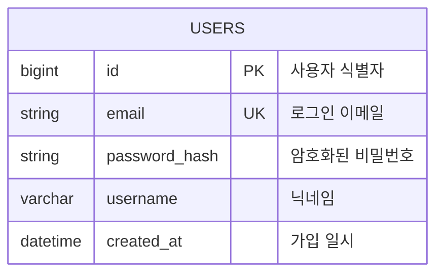
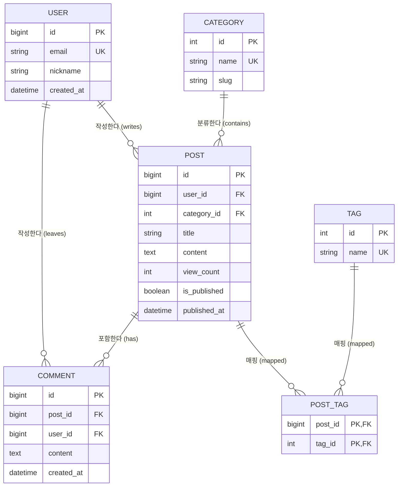


ER 다이어그램(Entity-Relationship Diagram, ERD)은 데이터베이스 시스템의 **엔티티(테이블) 구조와 속성(컬럼), 그리고 테이블 간의 관계**를 직관적으로 설계하고 문서화할 때 사용됩니다.

---

## 1. 기본 선언과 엔티티 정의

`erDiagram` 키워드로 시작하며, 각 엔티티 블록 내부에 `[데이터타입] [컬럼명] [키_제약조건] "[코멘트]"` 형태로 정의합니다.

- `PK`: Primary Key (기본키)
- `FK`: Foreign Key (외래키)
- `UK`: Unique Key (고유키)

#### 📝 작성 코드
```text
erDiagram
    USERS {
        bigint id PK "사용자 식별자"
        string email UK "로그인 이메일"
        string password_hash "암호화된 비밀번호"
        varchar username "닉네임"
        datetime created_at "가입 일시"
    }
```

#### 📊 렌더링 결과


---

## 2. 관계 및 카디널리티 (Cardinality) 기호

Mermaid는 까마귀 발(Crow's Foot) 표기법을 텍스트 기호로 지원합니다.

| 기호 | 왼쪽 카디널리티 | 오른쪽 카디널리티 | 관계 설명 |
| :--- | :--- | :--- | :--- |
| `||--||` | 정확히 1개 | 정확히 1개 | **1 대 1 (1:1 필수)** |
| `|o--||` | 0개 또는 1개 | 정확히 1개 | 0..1 대 1 (선택적 1:1) |
| `||--|{` | 정확히 1개 | 1개 이상 | **1 대 多 (1:N 필수)** |
| `||--o{` | 정확히 1개 | 0개 이상 | **1 대 多 (1:N 일반적)** |
| `}o--o{` | 0개 이상 | 0개 이상 | **多 대 多 (N:M)** |

### 식별 관계 vs 비식별 관계
- `--` : 실선 (식별 관계, 부모 키가 자식의 PK 일부가 됨)
- `..` : 점선 (비식별 관계, 일반적인 외래키 참조)

---

## 3. 실전 예제: 블로그 & 댓글 & 태그 시스템 ERD

#### 📝 작성 코드
```text
erDiagram
    USER ||--o{ POST : "작성한다 (writes)"
    USER ||--o{ COMMENT : "작성한다 (leaves)"
    CATEGORY ||--o{ POST : "분류한다 (contains)"
    POST ||--o{ COMMENT : "포함한다 (has)"
    POST ||--o{ POST_TAG : "매핑 (mapped)"
    TAG ||--o{ POST_TAG : "매핑 (mapped)"

    USER {
        bigint id PK
        string email UK
        string nickname
        datetime created_at
    }

    CATEGORY {
        int id PK
        string name UK
        string slug
    }

    POST {
        bigint id PK
        bigint user_id FK
        int category_id FK
        string title
        text content
        int view_count
        boolean is_published
        datetime published_at
    }

    COMMENT {
        bigint id PK
        bigint post_id FK
        bigint user_id FK
        text content
        datetime created_at
    }

    TAG {
        int id PK
        string name UK
    }

    POST_TAG {
        bigint post_id PK,FK
        int tag_id PK,FK
    }
```

#### 📊 렌더링 결과


---

## 📚 Mermaid 다이어그램 시리즈 목차
1. [[Mermaid #1] 순서도(Flowchart) 문법 및 사용법](/posts/mermaid-flowchart/)
2. [[Mermaid #2] 시퀀스 다이어그램(Sequence Diagram) 문법 및 API 흐름도](/posts/mermaid-sequence-diagram/)
3. [[Mermaid #3] 클래스 다이어그램(Class Diagram) 문법 및 클래스 설계](/posts/mermaid-class-diagram/)
4. [[Mermaid #4] 상태 다이어그램(State Diagram) 문법 및 상태 머신](/posts/mermaid-state-diagram/)
5. **[Mermaid #5] ER 다이어그램(ERD) 문법 및 DB 모델링** (현재 글)
6. [[Mermaid #6] Git 그래프(Git Graph) 문법 및 브랜치 시각화](/posts/mermaid-gitgraph/)
7. [[Mermaid #7] 간트 차트(Gantt Chart) 문법 및 일정 관리](/posts/mermaid-gantt-chart/)
8. [[Mermaid #8] 도형 색상 변경 및 스타일/특수효과 커스텀 가이드](/posts/mermaid-styling-customization/)

