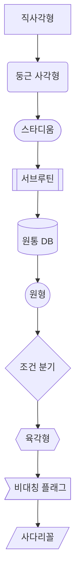
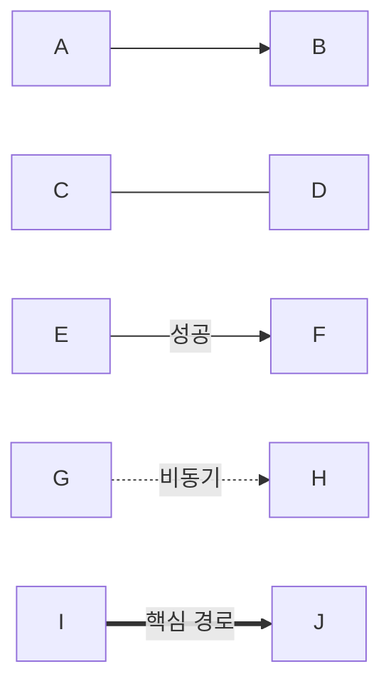
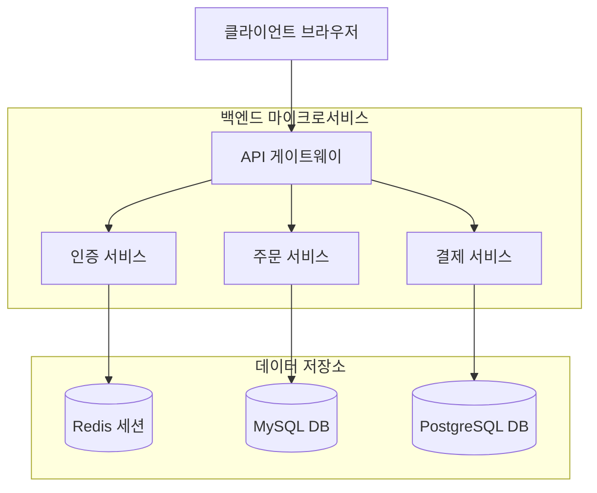
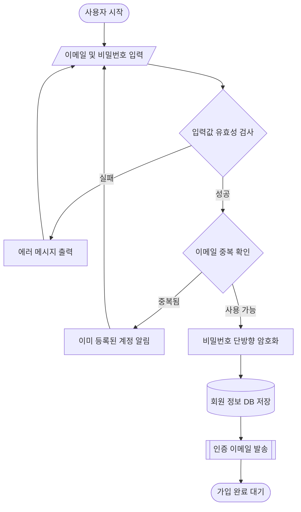


순서도(Flowchart)는 알고리즘, 비즈니스 로직, 시스템 데이터 파이프라인 등의 처리 흐름을 직관적으로 시각화할 때 가장 많이 사용되는 다이어그램입니다.

---

## 1. 기본 구조 및 방향 설정

순서도는 `flowchart` 키워드 뒤에 방향(Direction)을 선언하며 시작합니다.

| 방향 코드 | 의미 | 설명 |
| :--- | :--- | :--- |
| `TD` / `TB` | Top to Bottom | 위에서 아래로 (가장 흔히 사용) |
| `BT` | Bottom to Top | 아래에서 위로 |
| `LR` | Left to Right | 왼쪽에서 오른쪽으로 (단계별 파이프라인에 적합) |
| `RL` | Right to Left | 오른쪽에서 왼쪽으로 |

#### 📝 작성 코드
```text
flowchart LR
    A[입력] --> B[처리] --> C[출력]
```

#### 📊 렌더링 결과


---

## 2. 노드 모양 (Node Shapes)

다양한 괄호 조합을 사용하여 프로세스, 조건, 데이터베이스 등의 형태를 표현할 수 있습니다.

| 모양 | 문법 | 설명 |
| :--- | :--- | :--- |
| **직사각형 (기본)** | `id[텍스트]` | 일반 처리 / 단계 |
| **둥근 직사각형** | `id(텍스트)` | 시작 및 종료 |
| **스타디움 (알약형)** | `id([텍스트])` | 이벤트 / 시작점 |
| **서브루틴** | `id[[텍스트]]` | 정의된 모듈 / 함수 |
| **원통형 (DB)** | `id[(데이터베이스)]` | 스토리지 / DB |
| **원형** | `id((텍스트))` | 상태 / 접점 |
| **마름모 (조건 분기)** | `id{조건?}` | 의사결정 (If / Else) |
| **육각형** | `id{{텍스트}}` | 준비 / 반복 조건 |
| **비대칭 (플래그)** | `id>텍스트]` | 메시지 / 알림 |
| **사다리꼴** | `id[/수동 입력/]` | 사용자 입력 |

#### 📝 작성 코드
```text
flowchart TD
    N1[직사각형] --> N2(둥근 사각형)
    N2 --> N3([스타디움])
    N3 --> N4[[서브루틴]]
    N4 --> N5[(원통 DB)]
    N5 --> N6((원형))
    N6 --> N7{조건 분기}
    N7 --> N8{{육각형}}
    N8 --> N9>비대칭 플래그]
    N9 --> N10[/사다리꼴/]
```

#### 📊 렌더링 결과


---

## 3. 화살표 및 연결선 종류

| 연결선 형태 | 문법 | 용도 |
| :--- | :--- | :--- |
| **기본 화살표** | `A --> B` | 일반적인 다음 단계 |
| **선 (화살표 없음)** | `A --- B` | 단순 연관 |
| **텍스트 라벨 포함** | `A -- 텍스트 --> B` | 조건 및 설명 표기 |
| **점선 화살표** | `A -.-> B` | 비동기/참조 관계 |
| **점선 라벨 포함** | `A -. 텍스트 .-> B` | 설명이 포함된 점선 |
| **굵은 화살표** | `A ==> B` | 핵심 경로 / 강조 |
| **굵은 라벨 포함** | `A == 텍스트 ==> B` | 중요한 조건 분기 |

#### 📝 작성 코드
```text
flowchart LR
    A --> B
    C --- D
    E -- 성공 --> F
    G -. 비동기 .-> H
    I == 핵심 경로 ==> J
```

#### 📊 렌더링 결과


---

## 4. 서브그래프 (Subgraph) - 영역 그룹화

시스템 컴포넌트나 레이어별로 노드들을 묶어 가독성을 높일 수 있습니다.

#### 📝 작성 코드
```text
flowchart TD
    Client[클라이언트 브라우저] --> Gateway[API 게이트웨이]

    subgraph Backend [백엔드 마이크로서비스]
        Gateway --> AuthSvc[인증 서비스]
        Gateway --> OrderSvc[주문 서비스]
        Gateway --> PaymentSvc[결제 서비스]
    end

    subgraph Database [데이터 저장소]
        AuthSvc --> Redis[(Redis 세션)]
        OrderSvc --> OrderDB[(MySQL DB)]
        PaymentSvc --> PaymentDB[(PostgreSQL DB)]
    end
```

#### 📊 렌더링 결과


---

## 5. 실전 종합 예제: 회원가입 & 인증 흐름

#### 📝 작성 코드
```text
flowchart TD
    Start([사용자 시작]) --> Input[/이메일 및 비밀번호 입력/]
    Input --> ValidCheck{입력값 유효성 검사}

    ValidCheck -- 실패 --> ShowErr[에러 메시지 출력]
    ShowErr --> Input

    ValidCheck -- 성공 --> DuplCheck{이메일 중복 확인}
    DuplCheck -- 중복됨 --> ShowDupl[이미 등록된 계정 알림]
    ShowDupl --> Input

    DuplCheck -- 사용 가능 --> Hash[비밀번호 단방향 암호화]
    Hash --> SaveDB[(회원 정보 DB 저장)]
    SaveDB --> SendMail[[인증 이메일 발송]]
    SendMail --> Success([가입 완료 대기])
```

#### 📊 렌더링 결과


---

## 📚 Mermaid 다이어그램 시리즈 목차
1. **[Mermaid #1] 순서도(Flowchart) 문법 및 사용법** (현재 글)
2. [[Mermaid #2] 시퀀스 다이어그램(Sequence Diagram) 문법 및 API 흐름도]()
3. [[Mermaid #3] 클래스 다이어그램(Class Diagram) 문법 및 클래스 설계]()
4. [[Mermaid #4] 상태 다이어그램(State Diagram) 문법 및 상태 머신]()
5. [[Mermaid #5] ER 다이어그램(ERD) 문법 및 DB 모델링]()
6. [[Mermaid #6] Git 그래프(Git Graph) 문법 및 브랜치 시각화]()
7. [[Mermaid #7] 간트 차트(Gantt Chart) 문법 및 일정 관리]()

