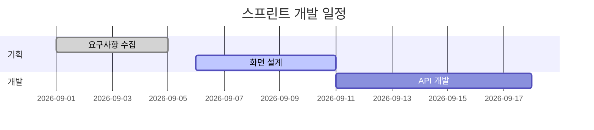
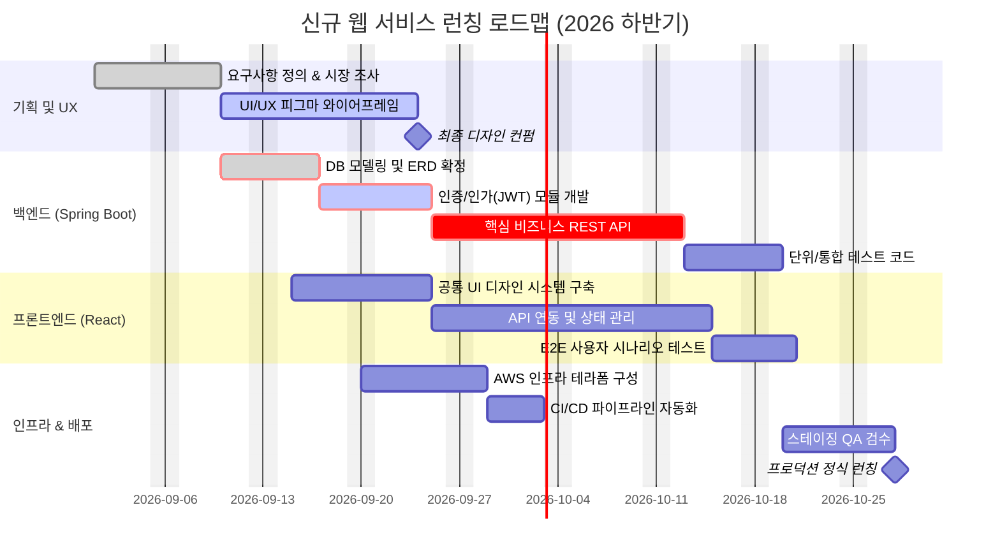


간트 차트(Gantt Chart)는 프로젝트의 **일정 계획, 작업 간의 선후 관계(의존성), 진행 상태(완료/진행 중), 마일스톤**을 타임라인 바 형태로 직관적으로 보여주는 차트입니다.

---

## 1. 기본 선언 및 주요 파라미터

`gantt` 키워드로 시작하며 날짜 포맷과 제목, 섹션을 지정합니다.

- `title`: 차트 상단 제목
- `dateFormat`: 입력 날짜 형식 (예: `YYYY-MM-DD`)
- `axisFormat`: X축 시간 눈금 표시 형식 (예: `%m-%d` 또는 `%Y-%m`)
- `excludes`: 일정에서 제외할 날짜나 요일 (예: `weekends`, `2026-10-03`)
- `section [이름]`: 작업 그룹 구분

#### 📝 작성 코드
```text
gantt
    title 스프린트 개발 일정
    dateFormat YYYY-MM-DD
    section 기획
    요구사항 수집 :done, t1, 2026-09-01, 2026-09-05
    화면 설계     :active, t2, 2026-09-06, 5d
    section 개발
    API 개발     :t3, after t2, 7d
```

#### 📊 렌더링 결과


---

## 2. 작업 상태 태그 및 의존 관계 (Dependencies)

작업명 뒤에 콜론(`:`)을 붙이고 상태 플래그, ID, 시작일/기간을 쉼표로 연결합니다.

### 2.1 상태 플래그
- `done`: 완료된 작업 (회색 빗금 또는 체크 표시)
- `active`: 현재 진행 중인 작업 (강조 표시)
- `crit`: 중요한 핵심 경로(Critical Path) 작업 (빨간색 강조)
- `milestone`: 마일스톤 (기간 0d, 다이아몬드 아이콘)

### 2.2 기간 및 의존성 표현
- `2026-09-01, 2026-09-10`: 시작일과 종료일 직접 지정
- `2026-09-01, 7d`: 시작일로부터 7일간 진행 (`d`: 일, `w`: 주, `h`: 시간)
- `after [태스크ID], 5d`: 특정 태스크 완료 후 바로 이어서 5일간 진행

---

## 3. 실전 예제: 웹 서비스 풀스택 런칭 프로젝트 일정

#### 📝 작성 코드
```text
gantt
    title 신규 웹 서비스 런칭 로드맵 (2026 하반기)
    dateFormat  YYYY-MM-DD
    excludes    weekends

    section 기획 및 UX
    요구사항 정의 & 시장 조사  :done,    req,  2026-09-01, 7d
    UI/UX 피그마 와이어프레임 :active,  ux,   after req,  10d
    최종 디자인 컨펌          :milestone, m1,   after ux,   0d

    section 백엔드 (Spring Boot)
    DB 모델링 및 ERD 확정    :crit, done, be_db,  2026-09-10, 5d
    인증/인가(JWT) 모듈 개발 :crit, active, be_auth, after be_db, 6d
    핵심 비즈니스 REST API    :crit, be_api, after be_auth, 12d
    단위/통합 테스트 코드     :be_test, after be_api, 5d

    section 프론트엔드 (React)
    공통 UI 디자인 시스템 구축 :fe_ui,   2026-09-15, 8d
    API 연동 및 상태 관리    :fe_api,  after be_auth, 14d
    E2E 사용자 시나리오 테스트:fe_test, after fe_api, 4d

    section 인프라 & 배포
    AWS 인프라 테라폼 구성   :infra,   2026-09-20, 7d
    CI/CD 파이프라인 자동화   :cicd,    after infra, 4d
    스테이징 QA 검수         :qa,      after be_test, 6d
    프로덕션 정식 런칭       :milestone, launch, after qa, 0d
```

#### 📊 렌더링 결과


---

## 📚 Mermaid 다이어그램 시리즈 목차
1. [[Mermaid #1] 순서도(Flowchart) 문법 및 사용법]()
2. [[Mermaid #2] 시퀀스 다이어그램(Sequence Diagram) 문법 및 API 흐름도]()
3. [[Mermaid #3] 클래스 다이어그램(Class Diagram) 문법 및 클래스 설계]()
4. [[Mermaid #4] 상태 다이어그램(State Diagram) 문법 및 상태 머신]()
5. [[Mermaid #5] ER 다이어그램(ERD) 문법 및 DB 모델링]()
6. [[Mermaid #6] Git 그래프(Git Graph) 문법 및 브랜치 시각화]()
7. **[Mermaid #7] 간트 차트(Gantt Chart) 문법 및 일정 관리** (현재 글)

