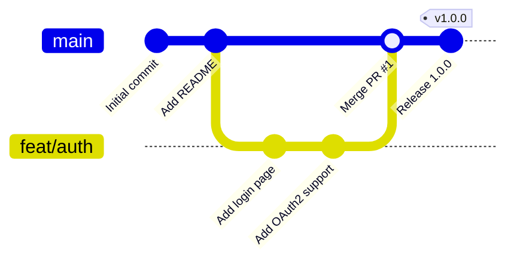
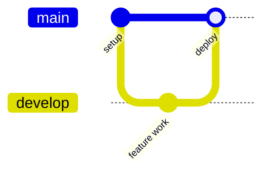
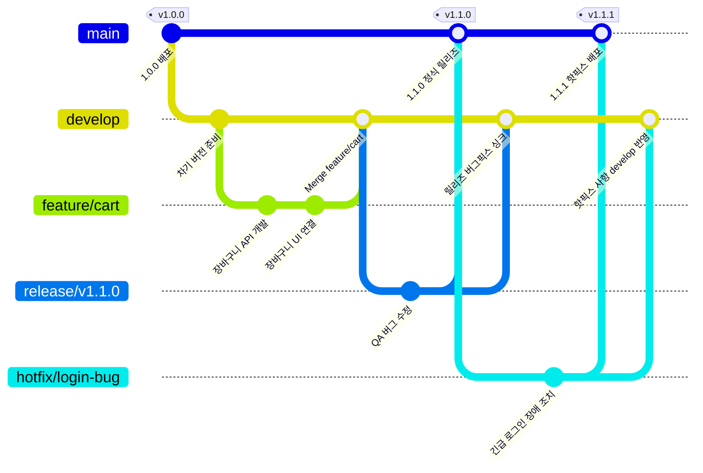


Git 그래프(Git Graph)는 팀 협업 시 **Git 브랜칭 전략(Git Flow, Trunk-based Flow), 커밋 히스토리, 머지(Merge), 릴리즈 태그**의 흐름을 텍스트 코드로 쉽게 시각화할 수 있는 유용한 기능입니다.

---

## 1. 기본 선언 및 핵심 명령어

`gitGraph` 키워드로 선언하며, 기본적으로 `main` 브랜치에서 시작합니다.

- `commit [id: "커밋명"] [tag: "태그명"] [type: HIGHLIGHT/REVERSE]`: 커밋 생성
- `branch [브랜치명] [order: 순서]`: 새 브랜치 분기
- `checkout [브랜치명]`: 작업 브랜치 전환
- `merge [브랜치명] [id: "머지커밋명"] [tag: "태그명"]`: 다른 브랜치의 변경사항 머지
- `cherry-pick id: "커밋ID"`: 특정 커밋 체리픽

#### 📝 작성 코드
```text
%%{init: { 'theme': 'default' } }%%
gitGraph
    commit id: "Initial commit"
    commit id: "Add README"
    branch feat/auth
    checkout feat/auth
    commit id: "Add login page"
    commit id: "Add OAuth2 support"
    checkout main
    merge feat/auth id: "Merge PR #1"
    commit id: "Release 1.0.0" tag: "v1.0.0"
```

#### 📊 렌더링 결과


---

## 2. 테마 및 방향 설정

상단에 `%%{init: ... }%%` 지시어를 사용하여 다이어그램의 테마나 방향(수직/수평)을 설정할 수 있습니다.

- `mainBranchName: "master"` : 기본 브랜치명을 master로 변경
- `showCommitLabel: true/false` : 커밋 라벨 표시 여부

#### 📝 작성 코드
```text
%%{init: { 'gitGraph': {'mainBranchName': 'main', 'showCommitLabel': true}} }%%
gitGraph
    commit id: "setup"
    branch develop
    checkout develop
    commit id: "feature work"
    checkout main
    merge develop id: "deploy"
```

#### 📊 렌더링 결과


---

## 3. 실전 예제: Git Flow 브랜치 전략 시각화

`main`, `develop`, `feature`, `release`, `hotfix` 브랜치 간의 상호작용을 한눈에 보여주는 전형적인 Git Flow 패턴입니다.

#### 📝 작성 코드
```text
%%{init: { 'theme': 'default' } }%%
gitGraph
    commit id: "1.0.0 배포" tag: "v1.0.0"
    
    branch develop
    checkout develop
    commit id: "차기 버전 준비"
    
    branch feature/cart
    checkout feature/cart
    commit id: "장바구니 API 개발"
    commit id: "장바구니 UI 연결"
    
    checkout develop
    merge feature/cart id: "Merge feature/cart"
    
    branch release/v1.1.0
    checkout release/v1.1.0
    commit id: "QA 버그 수정"
    
    checkout main
    merge release/v1.1.0 id: "1.1.0 정식 릴리즈" tag: "v1.1.0"
    
    checkout develop
    merge release/v1.1.0 id: "릴리즈 버그픽스 싱크"
    
    checkout main
    branch hotfix/login-bug
    checkout hotfix/login-bug
    commit id: "긴급 로그인 장애 조치"
    
    checkout main
    merge hotfix/login-bug id: "1.1.1 핫픽스 배포" tag: "v1.1.1"
    
    checkout develop
    merge hotfix/login-bug id: "핫픽스 사항 develop 반영"
```

#### 📊 렌더링 결과


---

## 📚 Mermaid 다이어그램 시리즈 목차
1. [[Mermaid #1] 순서도(Flowchart) 문법 및 사용법](/posts/mermaid-flowchart/)
2. [[Mermaid #2] 시퀀스 다이어그램(Sequence Diagram) 문법 및 API 흐름도](/posts/mermaid-sequence-diagram/)
3. [[Mermaid #3] 클래스 다이어그램(Class Diagram) 문법 및 클래스 설계](/posts/mermaid-class-diagram/)
4. [[Mermaid #4] 상태 다이어그램(State Diagram) 문법 및 상태 머신](/posts/mermaid-state-diagram/)
5. [[Mermaid #5] ER 다이어그램(ERD) 문법 및 DB 모델링](/posts/mermaid-er-diagram/)
6. **[Mermaid #6] Git 그래프(Git Graph) 문법 및 브랜치 시각화** (현재 글)
7. [[Mermaid #7] 간트 차트(Gantt Chart) 문법 및 일정 관리](/posts/mermaid-gantt-chart/)
8. [[Mermaid #8] 도형 색상 변경 및 스타일/특수효과 커스텀 가이드](/posts/mermaid-styling-customization/)

