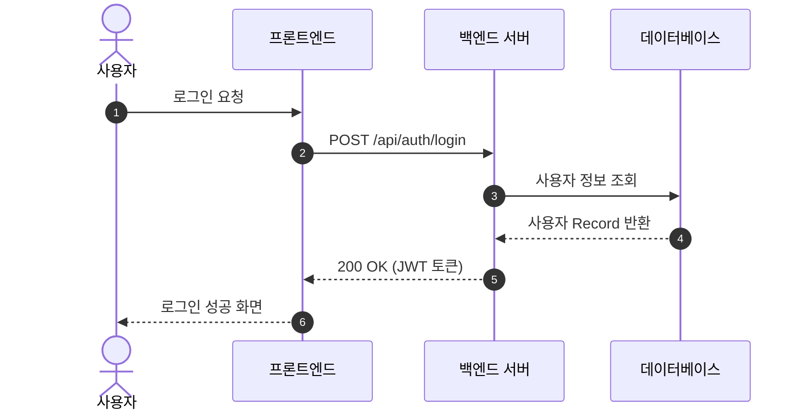
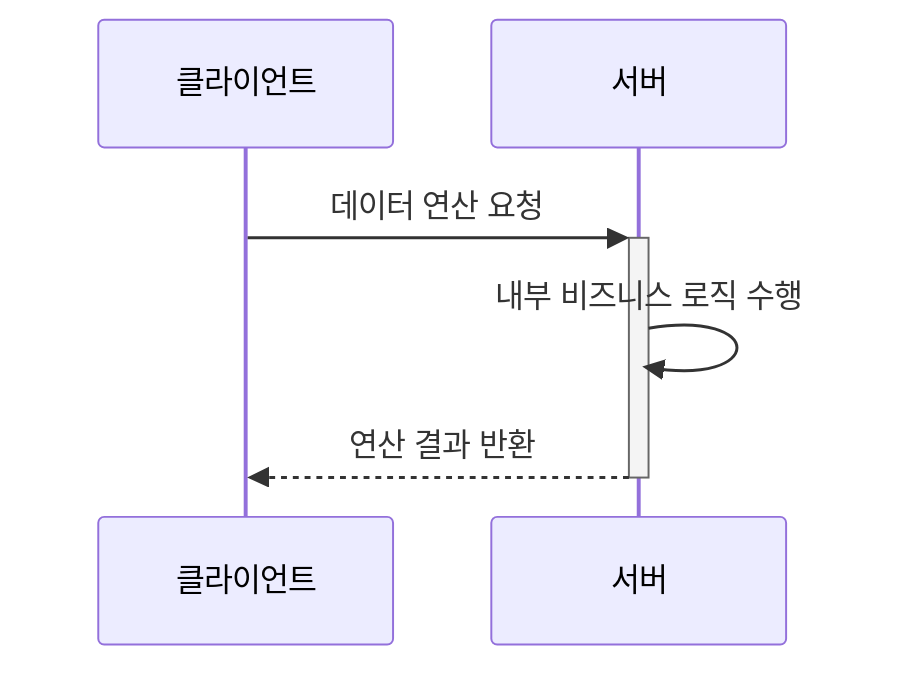
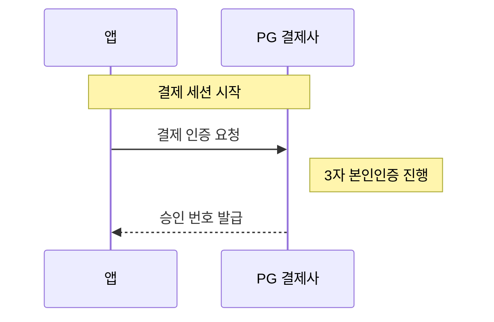
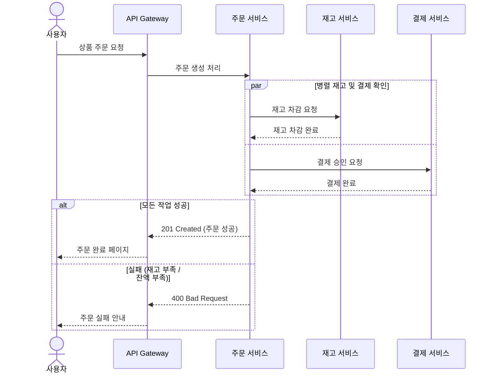
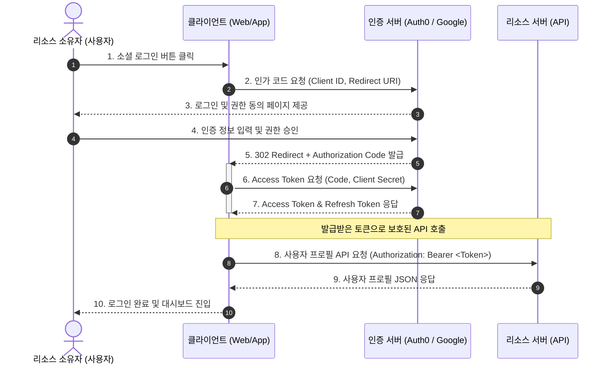


시퀀스 다이어그램(Sequence Diagram)은 객체, 서비스, 사용자 간에 일어나는 **시간 순서에 따른 상호작용과 메시지 흐름**을 명확하게 표현하는 데 사용됩니다.

API 명세서, 시스템 인증 절차, 백엔드 서비스 간 통신 흐름을 문서화할 때 유용합니다.

---

## 1. 기본 선언과 참가자 (Participant / Actor)

`sequenceDiagram` 키워드로 시작하며, `participant` 또는 `actor`(사람 모양)로 참여자를 정의합니다.

- `autonumber`: 메시지마다 번호를 자동으로 부여합니다.
- `as`: 긴 이름 대신 짧은 별칭(Alias)을 부여합니다.

#### 📝 작성 코드
```text
sequenceDiagram
    autonumber
    actor User as 사용자
    participant Frontend as 프론트엔드
    participant Backend as 백엔드 서버
    participant DB as 데이터베이스

    User->>Frontend: 로그인 요청
    Frontend->>Backend: POST /api/auth/login
    Backend->>DB: 사용자 정보 조회
    DB-->>Backend: 사용자 Record 반환
    Backend-->>Frontend: 200 OK (JWT 토큰)
    Frontend-->>User: 로그인 성공 화면
```

#### 📊 렌더링 결과


---

## 2. 화살표 및 메시지 유형

| 화살표 문법 | 의미 | 설명 |
| :--- | :--- | :--- |
| `A -> B` | 실선 (화살표 없음) | 단순 연결 |
| `A ->> B` | 실선 + 화살표 | **동기(Synchronous) 요청** |
| `A -->> B` | 점선 + 화살표 | **응답(Response)** |
| `A -x B` | 실선 + X 표시 | 요청 실패 / 메시지 유실 |
| `A --x B` | 점선 + X 표시 | 응답 실패 |
| `A -) B` | 실선 + 얇은 화살표 | **비동기(Asynchronous) 메시지** (이벤트 발행 등) |
| `A --) B` | 점선 + 얇은 화살표 | 비동기 응답 |

---

## 3. 활성화 수명선 (Activation Lifeline)

특정 객체가 작업을 처리 중인 상태(실행 구간)를 시각적으로 보여줍니다.

- 명시적: `activate [이름]` / `deactivate [이름]`
- 단축형: 화살표 끝에 `+` (활성화 시작), `-` (비활성화)

#### 📝 작성 코드
```text
sequenceDiagram
    participant Client as 클라이언트
    participant Server as 서버

    Client->>+Server: 데이터 연산 요청
    Server->>Server: 내부 비즈니스 로직 수행
    Server-->>-Client: 연산 결과 반환
```

#### 📊 렌더링 결과


---

## 4. 메모(Note) 추가

참가자의 위나 옆에 설명을 추가할 수 있습니다.

- `Note left of [객체]: 내용`
- `Note right of [객체]: 내용`
- `Note over [객체]: 내용`
- `Note over [객체A],[객체B]: 내용` (두 객체에 걸친 메모)

#### 📝 작성 코드
```text
sequenceDiagram
    participant App as 앱
    participant Payment as PG 결제사

    Note over App,Payment: 결제 세션 시작
    App->>Payment: 결제 인증 요청
    Note right of Payment: 3자 본인인증 진행
    Payment-->>App: 승인 번호 발급
```

#### 📊 렌더링 결과


---

## 5. 제어 구조: 조건문(alt/opt), 반복문(loop), 병렬(par)

- `alt / else`: 조건 분기 (if / else)
- `opt`: 선택적 실행 (단독 if)
- `loop`: 반복 실행
- `par / and`: 병렬 비동기 처리

#### 📝 작성 코드
```text
sequenceDiagram
    actor User as 사용자
    participant Gateway as API Gateway
    participant OrderSvc as 주문 서비스
    participant StockSvc as 재고 서비스
    participant PaySvc as 결제 서비스

    User->>Gateway: 상품 주문 요청
    Gateway->>OrderSvc: 주문 생성 처리
    
    par 병렬 재고 및 결제 확인
        OrderSvc->>StockSvc: 재고 차감 요청
        StockSvc-->>OrderSvc: 재고 차감 완료
    and
        OrderSvc->>PaySvc: 결제 승인 요청
        PaySvc-->>OrderSvc: 결제 완료
    end

    alt 모든 작업 성공
        OrderSvc-->>Gateway: 201 Created (주문 성공)
        Gateway-->>User: 주문 완료 페이지
    else 실패 (재고 부족 / 잔액 부족)
        OrderSvc-->>Gateway: 400 Bad Request
        Gateway-->>User: 주문 실패 안내
    end
```

#### 📊 렌더링 결과


---

## 6. 실전 예제: OAuth 2.0 인가 코드 흐름 (Authorization Code Flow)

#### 📝 작성 코드
```text
sequenceDiagram
    autonumber
    actor ResourceOwner as 리소스 소유자 (사용자)
    participant Client as 클라이언트 (Web/App)
    participant AuthServer as 인증 서버 (Auth0 / Google)
    participant ResourceServer as 리소스 서버 (API)

    ResourceOwner->>Client: 1. 소셜 로그인 버튼 클릭
    Client->>AuthServer: 2. 인가 코드 요청 (Client ID, Redirect URI)
    AuthServer-->>ResourceOwner: 3. 로그인 및 권한 동의 페이지 제공
    ResourceOwner->>AuthServer: 4. 인증 정보 입력 및 권한 승인
    
    AuthServer-->>Client: 5. 302 Redirect + Authorization Code 발급
    
    activate Client
    Client->>AuthServer: 6. Access Token 요청 (Code, Client Secret)
    AuthServer-->>Client: 7. Access Token & Refresh Token 응답
    deactivate Client

    Note over Client,ResourceServer: 발급받은 토큰으로 보호된 API 호출
    Client->>ResourceServer: 8. 사용자 프로필 API 요청 (Authorization: Bearer <Token>)
    ResourceServer-->>Client: 9. 사용자 프로필 JSON 응답
    Client-->>ResourceOwner: 10. 로그인 완료 및 대시보드 진입
```

#### 📊 렌더링 결과


---

## 📚 Mermaid 다이어그램 시리즈 목차
1. [[Mermaid #1] 순서도(Flowchart) 문법 및 사용법](/posts/mermaid-flowchart/)
2. **[Mermaid #2] 시퀀스 다이어그램(Sequence Diagram) 문법 및 API 흐름도** (현재 글)
3. [[Mermaid #3] 클래스 다이어그램(Class Diagram) 문법 및 클래스 설계](/posts/mermaid-class-diagram/)
4. [[Mermaid #4] 상태 다이어그램(State Diagram) 문법 및 상태 머신](/posts/mermaid-state-diagram/)
5. [[Mermaid #5] ER 다이어그램(ERD) 문법 및 DB 모델링](/posts/mermaid-er-diagram/)
6. [[Mermaid #6] Git 그래프(Git Graph) 문법 및 브랜치 시각화](/posts/mermaid-gitgraph/)
7. [[Mermaid #7] 간트 차트(Gantt Chart) 문법 및 일정 관리](/posts/mermaid-gantt-chart/)
8. [[Mermaid #8] 도형 색상 변경 및 스타일/특수효과 커스텀 가이드](/posts/mermaid-styling-customization/)

