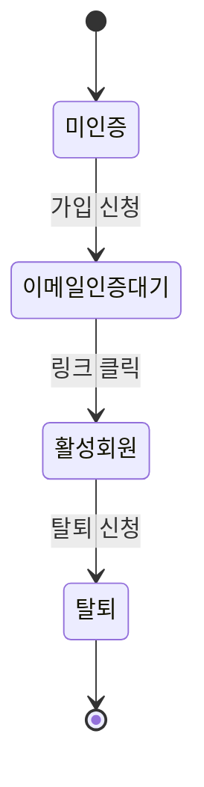
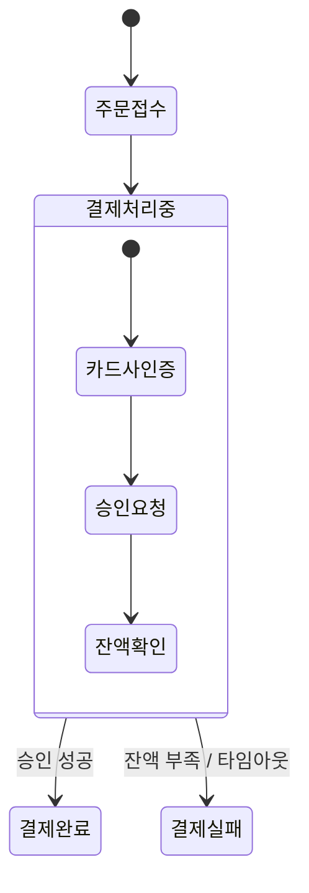
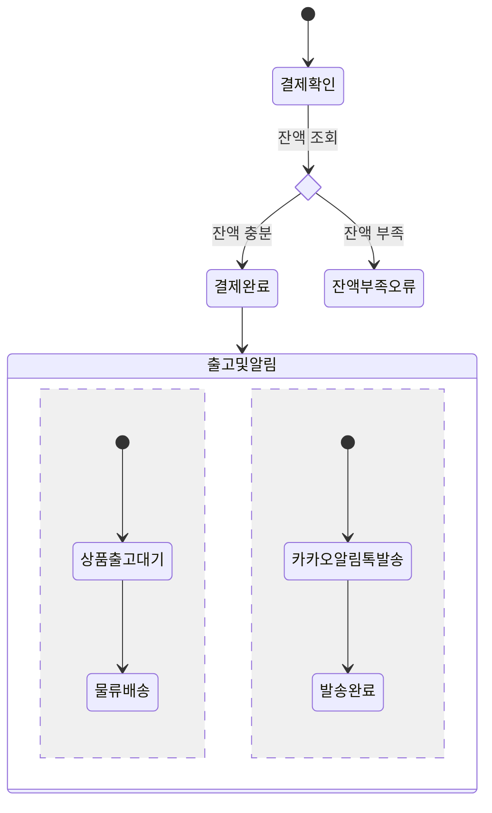
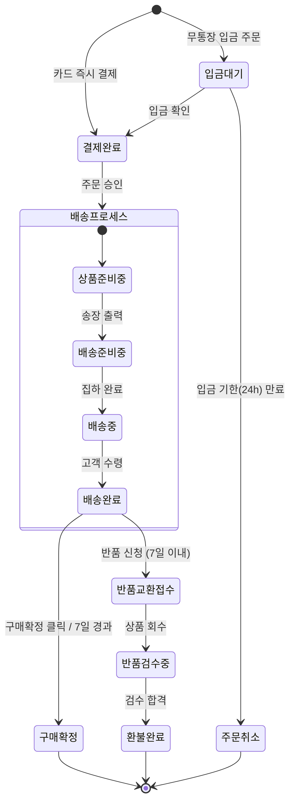


상태 다이어그램(State Diagram)은 객체나 시스템이 가질 수 있는 **유한한 상태들(Finite States)과 이벤트에 따른 상태 전이(Transition)**를 시각화할 때 사용됩니다.

주문 결제 상태, 사용자 계정 상태(활성/휴면/정지), 게임 캐릭터 상태 머신 등을 모델링하기에 적합합니다.

---

## 1. 기본 선언과 시작/종료점

`stateDiagram-v2` 키워드로 시작하며(최신 렌더러 기준), `[*]` 기호로 시작점과 종료점을 나타냅니다.

#### 📝 작성 코드
```text
stateDiagram-v2
    [*] --> 미인증
    미인증 --> 이메일인증대기 : 가입 신청
    이메일인증대기 --> 활성회원 : 링크 클릭
    활성회원 --> 탈퇴 : 탈퇴 신청
    탈퇴 --> [*]
```

#### 📊 렌더링 결과


---

## 2. 복합 상태 (Composite / Nested States)

하나의 큰 상태 내부에 여러 하위 상태들이 존재하는 계층적 구조를 `{ ... }` 블록으로 표현할 수 있습니다.

#### 📝 작성 코드
```text
stateDiagram-v2
    [*] --> 주문접수
    주문접수 --> 결제처리중

    state 결제처리중 {
        [*] --> 카드사인증
        카드사인증 --> 승인요청
        승인요청 --> 잔액확인
    }

    결제처리중 --> 결제완료 : 승인 성공
    결제처리중 --> 결제실패 : 잔액 부족 / 타임아웃
```

#### 📊 렌더링 결과


---

## 3. 분기(Choice) 및 병렬(Fork / Join) 상태

- `<<choice>>`: 조건에 따른 상태 분기
- `--`: 병렬(Concurrency) 동시 실행 분리

#### 📝 작성 코드
```text
stateDiagram-v2
    state if_balance <<choice>>
    
    [*] --> 결제확인
    결제확인 --> if_balance : 잔액 조회
    if_balance --> 결제완료 : 잔액 충분
    if_balance --> 잔액부족오류 : 잔액 부족

    결제완료 --> 출고및알림
    
    state 출고및알림 {
        [*] --> 상품출고대기
        상품출고대기 --> 물류배송
        --
        [*] --> 카카오알림톡발송
        카카오알림톡발송 --> 발송완료
    }
```

#### 📊 렌더링 결과


---

## 4. 실전 예제: 이커머스 주문-배송-환불 상태 머신

#### 📝 작성 코드
```text
stateDiagram-v2
    [*] --> 입금대기 : 무통장 입금 주문
    [*] --> 결제완료 : 카드 즉시 결제
    
    입금대기 --> 결제완료 : 입금 확인
    입금대기 --> 주문취소 : 입금 기한(24h) 만료

    state 배송프로세스 {
        [*] --> 상품준비중
        상품준비중 --> 배송준비중 : 송장 출력
        배송준비중 --> 배송중 : 집하 완료
        배송중 --> 배송완료 : 고객 수령
    }

    결제완료 --> 배송프로세스 : 주문 승인
    
    배송완료 --> 구매확정 : 구매확정 클릭 / 7일 경과
    구매확정 --> [*]

    배송완료 --> 반품교환접수 : 반품 신청 (7일 이내)
    반품교환접수 --> 반품검수중 : 상품 회수
    반품검수중 --> 환불완료 : 검수 합격
    환불완료 --> [*]

    주문취소 --> [*]
```

#### 📊 렌더링 결과


---

## 📚 Mermaid 다이어그램 시리즈 목차
1. [[Mermaid #1] 순서도(Flowchart) 문법 및 사용법]()
2. [[Mermaid #2] 시퀀스 다이어그램(Sequence Diagram) 문법 및 API 흐름도]()
3. [[Mermaid #3] 클래스 다이어그램(Class Diagram) 문법 및 클래스 설계]()
4. **[Mermaid #4] 상태 다이어그램(State Diagram) 문법 및 상태 머신** (현재 글)
5. [[Mermaid #5] ER 다이어그램(ERD) 문법 및 DB 모델링]()
6. [[Mermaid #6] Git 그래프(Git Graph) 문법 및 브랜치 시각화]()
7. [[Mermaid #7] 간트 차트(Gantt Chart) 문법 및 일정 관리]()

