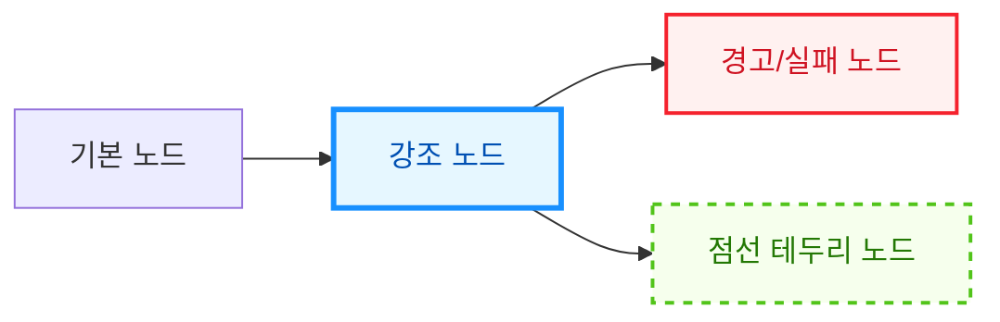
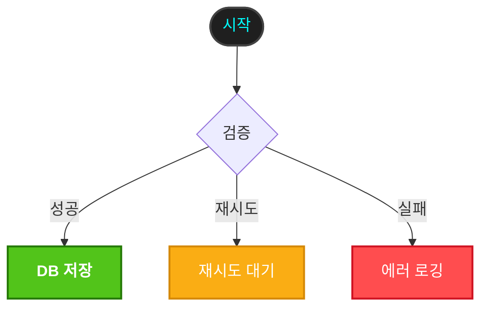
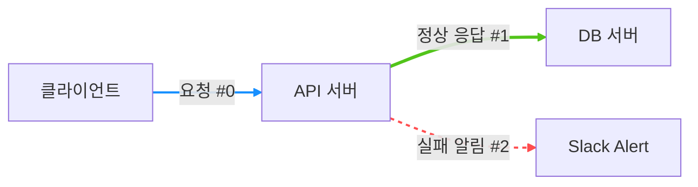
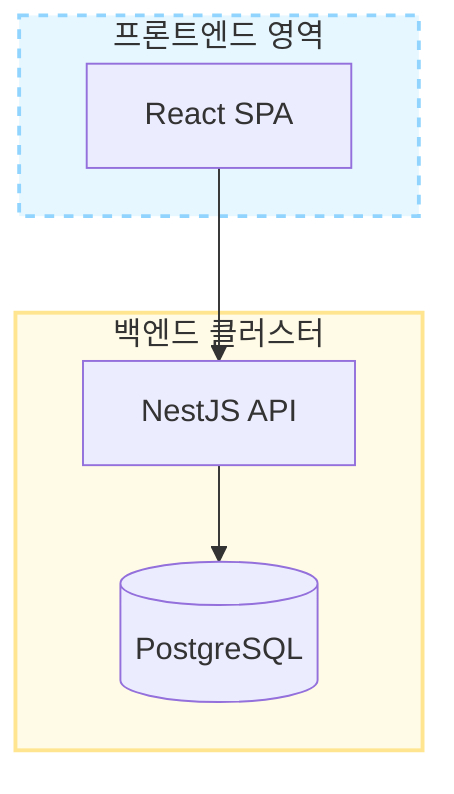
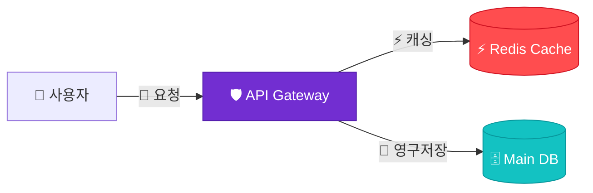


기본 Mermaid 다이어그램은 깔끔하지만, 상태(성공, 실패, 대기)를 구분하거나 특정 컴포넌트를 강조하고 싶을 때 **색상(Color)과 스타일(CSS)**을 입히면 전달력이 훨씬 높아집니다.

Mermaid에서 제공하는 **인라인 스타일링, 클래스(classDef) 재사용, 연결선 스타일링, 클릭 링크/툴팁, 아이콘 삽입 및 전역 테마 커스텀 방법**을 정리했습니다.

---

## 1. 단일 노드 인라인 스타일 (`style`)

개별 노드에 직접 스타일 속성을 부여할 때 `style` 키워드를 사용합니다.

### 주요 스타일 속성
- `fill`: 배경색 (`#RRGGBB`, `rgb()`, 색상이름)
- `color`: 텍스트 색상
- `stroke`: 테두리 선 색상
- `stroke-width`: 테두리 두께 (예: `2px`, `4px`)
- `stroke-dasharray`: 점선 효과 (예: `5 5`, `2 2`)
- `rx`, `ry`: 모서리 둥글기 반경

#### 📝 작성 코드
```text
flowchart LR
    A[기본 노드] --> B[강조 노드]
    B --> C[경고/실패 노드]
    B --> D[점선 테두리 노드]

    style B fill:#e6f7ff,stroke:#1890ff,stroke-width:3px,color:#0050b3
    style C fill:#fff1f0,stroke:#f5222d,stroke-width:2px,color:#cf1322
    style D fill:#f6ffed,stroke:#52c41a,stroke-width:2px,stroke-dasharray: 5 5,color:#237804
```

#### 📊 렌더링 결과


---

## 2. 클래스 정의 및 재사용 (`classDef` & `:::`)

여러 노드에 일관된 디자인 시스템(예: 성공/진행중/에러)을 적용할 때는 `classDef`를 정의하여 재사용하는 것이 훨씬 효율적입니다.

### 클래스 적용 방법 2가지
1. **단축 문법 (`노드ID:::클래스명`)**: 노드 선언과 동시에 적용
2. **명시적 지정 (`class 노드1,노드2 클래스명`)**: 하단에 묶어서 적용

#### 📝 작성 코드
```text
flowchart TD
    %% 1. 클래스 정의
    classDef success fill:#52c41a,stroke:#237804,stroke-width:2px,color:#ffffff,font-weight:bold;
    classDef warning fill:#faad14,stroke:#d48806,stroke-width:2px,color:#ffffff;
    classDef danger fill:#ff4d4f,stroke:#cf1322,stroke-width:2px,color:#ffffff;
    classDef dark fill:#1f1f1f,stroke:#434343,stroke-width:2px,color:#00ffff;

    %% 2. 단축 문법 (:::) 적용
    Start([시작]):::dark --> Check{검증}
    
    %% 3. 노드 연결
    Check -->|성공| S1[DB 저장]
    Check -->|재시도| W1[재시도 대기]
    Check -->|실패| E1[에러 로깅]

    %% 4. 일괄 클래스 지정
    class S1 success;
    class W1 warning;
    class E1 danger;
```

#### 📊 렌더링 결과


> 💡 **전체 기본 스타일 변경**: `classDef default fill:#f0f0f0,stroke:#333;`처럼 `default` 클래스를 정의하면 모든 노드의 기본 스타일이 일괄 변경됩니다.

---

## 3. 연결선(Edge) 스타일링 (`linkStyle`)

노드 사이의 화살표나 선에도 색상, 두께, 점선 효과를 부여할 수 있습니다. 위에서부터 선이 선언된 순서대로 **0번 인덱스**가 부여됩니다.

- `linkStyle 0 stroke:#ff4d4f,stroke-width:3px;` (특정 순서의 연결선 변경)
- `linkStyle default stroke:#1890ff,stroke-width:2px;` (모든 연결선 기본 변경)

#### 📝 작성 코드
```text
flowchart LR
    A[클라이언트] -->|요청 #0| B[API 서버]
    B -->|정상 응답 #1| C[DB 서버]
    B -.->|실패 알림 #2| D[Slack Alert]

    linkStyle 0 stroke:#1890ff,stroke-width:2px;
    linkStyle 1 stroke:#52c41a,stroke-width:3px;
    linkStyle 2 stroke:#ff4d4f,stroke-width:2px,stroke-dasharray: 4 4;
```

#### 📊 렌더링 결과


---

## 4. 서브그래프(Subgraph) 영역 스타일링

특정 그룹(서브그래프)의 배경색이나 테두리에도 `style [서브그래프ID] [속성]`으로 영역을 강조할 수 있습니다.

#### 📝 작성 코드
```text
flowchart TB
    subgraph Frontend [프론트엔드 영역]
        A[React SPA]
    end

    subgraph Backend [백엔드 클러스터]
        B[NestJS API] --> C[(PostgreSQL)]
    end

    A --> B

    style Frontend fill:#e6f7ff,stroke:#91d5ff,stroke-width:2px,stroke-dasharray: 5 5
    style Backend fill:#fffbe6,stroke:#ffe58f,stroke-width:2px
```

#### 📊 렌더링 결과


---

## 5. 인터랙션 및 특수효과 (클릭 링크 & 이모지/아이콘)

### 1) 클릭 링크 및 툴팁 (`click`)
노드를 클릭했을 때 특정 URL로 이동하거나 마우스를 올렸을 때 툴팁을 표시할 수 있습니다.

- 문법: `click 노드ID "URL" "툴팁텍스트"`

#### 📝 작성 코드
```text
flowchart LR
    A[Google 이동하기] --> B[GitHub 블로그 이동]

    click A "https://www.google.com" "구글로 이동합니다"
    click B "https://github.com" "깃허브로 이동합니다"

    style A fill:#4285f4,color:#fff,stroke:#1a73e8
    style B fill:#24292e,color:#fff,stroke:#000
```

#### 📊 렌더링 결과


### 2) 이모지 및 아이콘 활용
텍스트 라벨 내에 유니코드 이모지를 직접 넣으면 시각적 직관성이 극대화됩니다.

#### 📝 작성 코드
```text
flowchart LR
    User[👤 사용자] -->|🚀 요청| Gateway[🛡️ API Gateway]
    Gateway -->|⚡ 캐싱| Redis[(⚡ Redis Cache)]
    Gateway -->|💾 영구저장| DB[(🗄️ Main DB)]

    style Gateway fill:#722ed1,color:#fff,stroke:#531dab
    style Redis fill:#ff4d4f,color:#fff,stroke:#cf1322
    style DB fill:#13c2c2,color:#fff,stroke:#08979c
```

#### 📊 렌더링 결과


---

## 6. 전역 테마 및 변수 디렉티브 (`%%{init: ...}%%`)

다이어그램 상단에 `%%{init: ...}%%` 지시자를 추가하면 전체 렌더링 테마와 폰트, 기본 색상 팔레트를 한 번에 바꿀 수 있습니다.

### 내장 테마 종류
- `default` : 기본 밝은 테마
- `forest` : 자연스러운 그린 계열
- `dark` : 다크 모드
- `neutral` : 흑백/그레이스케일 계열
- `base` : 사용자 정의 변수(`themeVariables`)로 완전 커스텀할 때 사용

#### 📝 작성 코드
```text
%%{init: {'theme':'forest', 'themeVariables': { 'primaryColor': '#a0d911', 'edgeLabelBackground':'#ffffff', 'tertiaryColor': '#fff'}}}%%
flowchart LR
    Client[클라이언트] --> Server[웹 서버]
    Server --> DB[(데이터베이스)]
```

#### 📊 렌더링 결과


---

## 7. 스타일링 문법 요약 정리

| 기능 | 문법 | 예시 |
| :--- | :--- | :--- |
| **인라인 스타일** | `style [노드ID] [속성:값]` | `style A fill:#f9f,stroke:#333,stroke-width:4px` |
| **클래스 정의** | `classDef [클래스명] [속성:값]` | `classDef alert fill:#f00,color:#fff;` |
| **클래스 적용 1** | `[노드ID]:::클래스명` | `A[에러]:::alert` |
| **클래스 적용 2** | `class [노드1,노드2] [클래스명]` | `class A,B alert;` |
| **기본 스타일 변경** | `classDef default [속성:값]` | `classDef default fill:#eee,stroke:#999;` |
| **연결선 스타일** | `linkStyle [인덱스/default] [속성:값]` | `linkStyle 0 stroke:#f00,stroke-width:2px;` |
| **서브그래프 스타일** | `style [서브그래프ID] [속성:값]` | `style GroupA fill:#e6f7ff,stroke:#1890ff` |
| **클릭 링크/툴팁** | `click [노드ID] "[URL]" "[툴팁]"` | `click A "https://..." "바로가기"` |
---

## 📚 Mermaid 다이어그램 시리즈 목차
1. [[Mermaid #1] 순서도(Flowchart) 문법 및 사용법](/posts/mermaid-flowchart/)
2. [[Mermaid #2] 시퀀스 다이어그램(Sequence Diagram) 문법 및 API 흐름도](/posts/mermaid-sequence-diagram/)
3. [[Mermaid #3] 클래스 다이어그램(Class Diagram) 문법 및 클래스 설계](/posts/mermaid-class-diagram/)
4. [[Mermaid #4] 상태 다이어그램(State Diagram) 문법 및 상태 머신](/posts/mermaid-state-diagram/)
5. [[Mermaid #5] ER 다이어그램(ERD) 문법 및 DB 모델링](/posts/mermaid-er-diagram/)
6. [[Mermaid #6] Git 그래프(Git Graph) 문법 및 브랜치 시각화](/posts/mermaid-gitgraph/)
7. [[Mermaid #7] 간트 차트(Gantt Chart) 문법 및 일정 관리](/posts/mermaid-gantt-chart/)
8. **[Mermaid #8] 도형 색상 변경 및 스타일/특수효과 커스텀 가이드** (현재 글)

